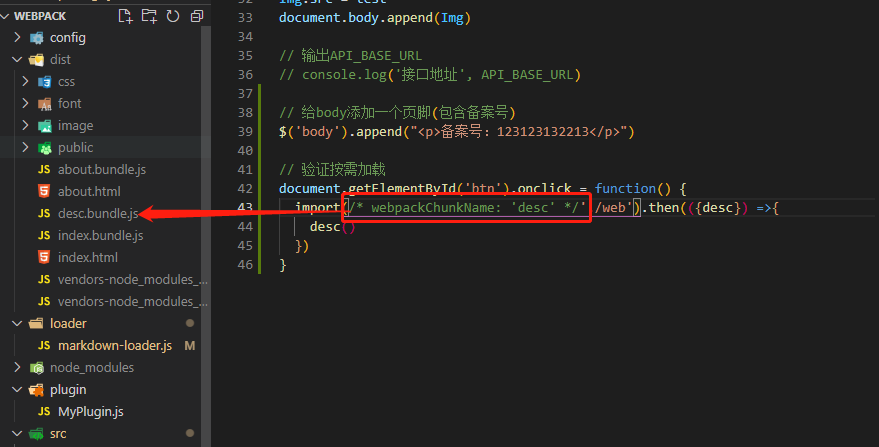
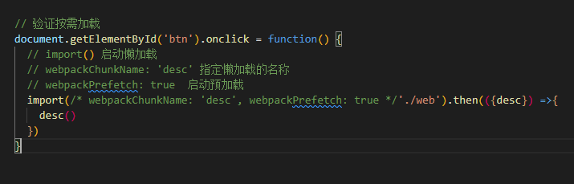

- 初始化项目
  - npm init -y
- 安装webpack
  - npm install -D webpack webpack-cli
- 创建入口文件
  - src/index.js
- 执行打包（必须制定mode）
  - webpack ./src/index.js --output-path ./dist --mode=development

## webpack配置文件（webpack.config.js）

- webpack.config.js是以CommonJS规范进行组织的

```shell
1.mode(模式)
2.entry(入口)
3.output(出口)
4.module(模块配置-不同类型文件的配置-loader配置)
5.plugins(插件)
6.devServer(开发服务器的配置)
```


## loader

> ​	webpack 只能理解 JavaScript 和 JSON 文件，这是 webpack 开箱可用的自带能力。**loader** 让 webpack 能够去处理其他类型的文件，并将它们转换为有效 [模块](https://webpack.docschina.org/concepts/modules)，以供应用程序使用，以及被添加到依赖图中。
>
> 在更高层面，在 webpack 的配置中，**loader** 有两个属性：
>
> 1. `test` 属性，识别出哪些文件会被转换。
> 2. `use` 属性，定义出在进行转换时，应该使用哪个 loader。
>
> <font color='red'>loader执行顺序：先右后左（先下后上）</font>

### 1.webpack打包css

- 非 JS 文件打包，需要对应的 loader
  - css-loader 将 css 转化为 js （将 css 输出到打包后的 js 文件中）
  - style-loader 把包含 css 内容的 JS 代码，挂在到页面的 <style> 标签中

```shell
1.引入 css 文件 (import "./css/main.css")
	页面无法识别 import 语法，所以会报错
2.安装(npm i css-loader style-loader-D)
3.配置
	匹配后缀名：test:/\.css$/i,
	指定加载器：use:['style-loader','css-loader']
		先将css转成js，再将js中的样式挂载到<style>中
```


### 2.webpack打包less

```shell
1.引入less
	import './css/main.less'
2.安装
	npm i less less-loader -D
3.配置
	配置后缀名：test:/\.less$/i
	指定加载器：use:['style-loader','css-loader','less-loader']
		将less转成css，将css转成js，将js中的样式挂载到<style>中
```


### 3. 将 css 打包成独立的文件

​	上面方法是将 css 打包成js通过<style>挂载到页面中的

```shell
1.安装插件
	npm i mini-css-extract-plugin -D
2.引入插件(webpack.config.js)
	const MiniCssExtractPlugin = require('mini-css-extract-plugin')
3.替换 style-loader (use:[MiniCssExtractPlugin.loader,'css-loader'])
	style-loader：将css打包到<style>标签中
	MiniCssExtractPlugin.loader：将css打包到独立文件中
4.配置插件(new MiniCssExtractPlugin({}))
```


### 4.打包css-添加样式前缀

```shell
1.安装插件
	npm i postcss-loader autoprefixer -D
2.配置插件 webpack.config.js
	use:[MiniCssExtractPlugin.loader,'css-loader','postcss-loader']
3.新建 postcss.config.js
	plugins:[require('autoprefixer')]
4.配置需要兼容的浏览器
	package.json中指定browserslist属性（推荐）
	详情参考：https://www.npmjs.com/package/browserslist
		"browserslist":[
			"last 1 version", // 最后一个版本
			"> 1%"			  // 代表全球超过 1% 使用的浏览器
		]
	【或者】
	在项目根目录下创建 .browserslistrc
		last 1 version
        > 1%
```


### 5.打包css-格式校验

```shell
1.安装
	npm i stylelint stylelint-config-standard stylelint-webpack-plugin -D
		① stylelint
			https://stylelint.io/
			校验规则（number-leading-zero）
				opacity: .5;	语法错误
				opacity: 0.5;	语法正确
		② stylelint-config-standard
		③ stylelint-webpack-plugin
2.引入
	const StylelintPlugin = require('stylelint-webpack-plugin')
3.配置 (plugins 属性中)
	new StylelintPlugin({})
4.指定校验规则
	① 在 package.json 中的 stylelint 属性指定规则
		"stylelint":{
			"extends":"stylelint-config-standard",
			// 后续为扩展配置（如果不需要自定义规则，可以忽略 rules）
			"rules": {}
		}
	② 在 .stylelintrc 中指定规则
	③ 在 stylelint.config.js 中指定规则
	
```


### 6.打包css-压缩css

```shell
1.安装
	npm i optimize-css-assets-webpack-plugin -D
2.引入
	const OptimizeCssAssetsPlugin = require('optimize-css-assets-webpack-plugin')
3.配置 (plugins 属性中)
	new OptimizeCssAssetsPlugin()
```


### 7.webpack 打包HTML

- html-webpack-plugin
  - 生成 HTML 文件（用于服务器访问），并在 HTML 中加载所有的打包资源
  - 指定 HTML 模板、设置 HTML 变量、压缩 HTML

```shell
1.安装
	npm i html-webpack-plugin -D
2.配置
	const HtmlWebpackPlugin = require('html-webpack-plugin')
	new HtmlWebpackPlugin()
```


### 8.webpack编译js

- 将 ES6+ 转成 ES5 ，从而保证JS在低版本浏览器的兼容性

```shell
1.安装
	npm i babel-loader @babel/core @babel/preset-env -D
	
2.配置
	https://www.npmjs.com/package/babel-loader
	
3.【注：】
	@babel/preset-env 只能转译基本语法（peomise 就不能转换）
	@babel/polyfill 可以转译所有 js 新语法
        npm i @babel/polyfill -D
        import '@babel/polyfill' (入口文件中引入)
        但是 polyfill 转译将所有js的新语法都进行了转译，可以使用 core-js（按需转译js新语法）
       
     安装：npm i core-js -D
     配置：① 按需加载 useBuiltIns:'usage' ② 指定版本 corejs: 3
```


### 9.webpack校验js代码格式

```shell
1.安装
	npm i eslint eslint-config-airbnb-base eslint-webpack-plugin eslint-plugin-import -D
	① eslint（校验 JS 代码格式的工具）
	② eslint-config-airbnb-base （js代码格式规范）
	③ eslint-webpack-plugin（webpack 的 eslint 插件）
	④ eslint-plugin-import 用于在 package.json 中读取 eslintConfig 配置项
2.配置
	① eslint-webpack-plugin
		const ESLintPlugin = require('eslint-webpack-plugin')
		plugins: [new ESLintPlugin()]
	② eslintConfig（package.json）
		"eslintConfig": {"extends": "airbnb-base"}
```


### 10.webpack 打包图片

- <font color='red'>**file-loader** </font>
  - 将使用到的图片复制到输出目录，过滤掉未使用的图片

```shell
1.安装
	npm i file-loader -D
2.配置
	rules: [{
        test: /\.(png|gif|jpe?g)$/i,
        use:{loader: 'file-loader'}
      }]
```

##### 处理css中的图片路径问题（例如：背景图片加载失败）

```shell
{
        test: /\.css$/i,
        use: [
        	{
                options: {
                    publicPath: '../'	// 为背景图片指定路径
                },
                loader:MiniCssExtractPlugin.loader
            },
          	"css-loader",
          	"postcss-loader",
        ],
},
```

- <font color='red'>**url-loader**</font>
  - 是 file-loader 升级版，如果图片小于配置大小，会转成base64字符串
  - 转成base64字符串后，图片会跟js一起加载（减少图片的请求次数）

```shell
1.安装
	npm i url-loader -D
2.配置
	 module: {
       rules: [
           {
               test: /\.(png|jpg|gif)$/i,
               use: [
                   {
                       loader: 'url-loader',
                       options: {
                           limit: 15000,//文件大小限制，小于则用base64编码
                           esModule: false //关闭es模块语法
                       }
                   }
               ],
               type: 'javascript/auto'
           },
       ]
    }
```

> ​	**【url-loader配置问题】**： 当图片文件的大小小于limit属性值时，打包后的css会生成以base64编码的图片，当图片文件的大小大于limit属性时，打包后是会生成相应文件的。
>
> ① 会出现重复图片的问题在于：
>
> 我们在webpack5.0中使用了旧的资源模块加载器，如file-loader,url-loadre这些，但是webpack5.0本身已经内置了asset资源模块来处理，这就可能会导致asset重复。
>
> 解决方法：将asset的模块类型设置为 ：type: 'javascript/auto'
>
> ② 背景图片无法正常显示
>
> 原因为：url-loader,file-loader都是采用es6语法规范的，而不是commonjs规范
>
> 由于url-loader,file-loader中可以通过esModule属性来选择是否关闭es6语法规范，
>
> 故解决方法为添加如下语句关闭es6语法规范：esModule: false。

>其实，如果install的是webpack5.0的话，正如前文所言，已经废弃了assert loader,(如 file-loader, url-loader等），就不需要那么麻烦，去相方设法配置版本的兼容性问题。可以直接如下操作，测试过也能正常在浏览器上显示背景图片。
>
>module: {
>       rules: [
>           {
>               test: /\.(png|jpg|gif)$/i,
>              }
>    }

- <font color='red'>**html-loader**</font>
  - 将HTML导出为字符串（负责引入img，从而能被url-loader进行处理

> - html-loader 与 html-webpack-plugin 的冲突
>   - 原因： html-webpack-plugin会检查目标文件中是否已经有了loader处理，如果有其他loader处理， html-webpack-plugin不再使用 lodash.template 去处理 ejs 语法
>   - 解决：将html-webpack-plugin中，模板文件后缀名改成 .ejs (非 .html)


### 11.webpack 打包字体文件

- file-loader

```she
1.安装
	npm i file-loader -D
2.配置
	test: /\.(eot|svg|ttf|woff|woff2)$/i
```

- copy-webpack-plugin
  - 不需要处理的其他文件，可以直接复制到输出目录

```shell
1.安装
	npm i copy-webpack-plugin -D
2.配置
	const CopyWebpackPlugin = require('copy-webpack-plugin')
	// 直接将src下不需要特殊处理的文件，直接复制到输出目录中
    new CopyWebpackPlugin({
      patterns: [
        {
          from: 'src/public',
          to: 'public'
        }
      ]
    })
```

- clean-webpack-plugin
  - 每次打包之前，删除历史文件

```shell
1.安装
	npm i clean-webpack-plugin -D
2.配置
	const {CleanWebpackPlugin} = require('clean-webpack-plugin')
	new CleanWebpackPlugin()
```


## 资源模块（Asset Modules）

- webpack4
  - raw-loader（将文件导入为字符串）
  - file-loader（将文件发送到输出目录）
  - url-loader（将文件发送到输出目录，或转为 Data URI 内联到 bundle 中）
- webpack5
  - asset/resource 发送一个单独的文件并导出 URL （之前通过使用 file-loader 实现）
  - asset/inline 导出一个资源的 data URI （之前通过使用 url-loader 实现）
  - asset/source 导出资源的源代码（之前通过使用 raw-loader 实现）
  - asset 在导出一个 data URI 和发送一个单独的文件之间自动选择（url-loader）


## webpack Dev Server

- 作用：发布web服务，提高开发效率
- 详情：
  - https://www.npmjs.com/package/webpack-dev-server
  - https://webpack.docschina.org/configuration/dev-server
- 使用
  - webpack4：webpack-dev-server
  - webpack5：webpack serve


## webpack 进阶

### webpack 区分环境打包

- 通过环境变量区分打包
- 通过配置文件区分

#### 1.webpack通过环境变量区分打包

- 命令行中设置环境
  - webpack4：webpack --env.production
  - webpack5：打包命令：webpack --env production 运行命令：webpack serve --env production

- webpack.config.js

  - 读取环境变量 env.production

  - 根据环境变量指定不同的配置

    - ```javascript
      moduels.exports = (env, argv) => {
      	// 开发环境配置
          const config = {
              mode: 'development',
          // 其他配置
          }
          if(env.production) {
              // 生产环境
              config.mode = 'production'
              // 其他配置
          }
          
          return config
      }
      ```
      

#### 2.webpack通过配置文件区分打包

- 通过配置文件区分环境
  - webpack.dev.conf.js（mode：development）
  - webpack.prod.conf.js（mode：production）
  - webpack.base.conf.js（公共配置）
- webpack-merge
  - 将多个配置合并在一起
  - npm i webpack-merge -D
- 命令行中输出打包指令：webpack --config ./webpack.dev.conf.js

> webpack --config ./webpack.dev.conf.js 通过命令行输入前面的长命令容易出现错误且较为麻烦。
>
> 可以在 `package.json`文件件中添加打包命令:

```javascript
"scripts": {
    "test": "echo \"Error: no test specified\" && exit 1",
    "serve": "webpack serve",
     // 开发环境打包 npm run build:dev
    "build:dev": "webpack --config config/webpack.dev.conf.js",
     // 生产环境打包 npm run build:prod
    "build:prod": "webpack --config config/webpack.prod.conf.js"
}
```

####  3.webpack DefinePlugin

- DefinePlugin
  - 为配置注入全局变量
  - 开发环境和生产环境的接口地址不同

```javascript
const webpack = ewquire('webpack')
module.exports = {
    plugins: [
        new webpack.DefinePlugin({
            //变量值要求的是一个代码片段
            API_BASE_URL: JSON.stringify('https://api.example.com')
        })
    ]
}
```


### 自定义plugin

- webpack插件是一个具有apply方法的JavaScript对象。apply方法会被webpack  compiler调用，并且在整个编译生命周期都可以访问compiler对象。
- 原理：
  - 通过生命周期的钩子中挂载函数，来实现功能扩展。
  - https://webpack.docschina.org/concepts/plugins/

#### 1.webpack钩子函数

| 钩子        | 描述                 | 类型            |
| ----------- | -------------------- | --------------- |
| environment | 环境准备好           | SyncHook        |
| compile     | 编译开始             | SyncHook        |
| compilation | 编译结束             | SyncHook        |
| emit        | 打包资源到output之前 | AsyncSeriesHook |
| afterEmit   | 打包资源到output之后 | AsyncSeriesHook |
| done        | 打包完成             | SyncHook        |


### 自定义loader

- loader本质上就是一个 ESM 模块，它导出一个函数，在函数中对打包资源进行转换
- 声明一个读取markdown（.md）文件内容的loader
  - marked（将markdown语法转成html）
  - loader-utils（接受loader的配置项）
  - npm i marked loader-utils -D

```javascript
// 自定义 loader 的语法
const {getOptions} = require('loader-utils')
const marked = require('marked')

// 自定义loader
module.exports = function(source) {
    // 获取 loader 配置项
    const options = getOptions(this)
    
    // 对输出内容进行处理
    const html = marked(source)
    
    // 返回个下一个 loader 处理
    return html
}
```


### 代码分离（Code Splitting）

#### 1.多入口打包

- entry（后面写成对象）
  - {index: './src/index.js', about:'./src/about.js'}
- output.filename（不能写成固定名称，否则报错）
  - [name].bundle.js
- HtmlWebpackPlugin（ 不同页面加载各自的bundle）
  - chunks：['index'],  	index.html 加载 index.bundle.js
  - chunks：['about'],     about.html 加载 about.bundle.js


#### 2.提取公共模块

```javascript
optimization: {
      splitChunks: {
        chunks: 'all'
      }
    }
```


#### 3.动态导入

- 懒加载
  - 默认不加载，事件触发后才加载
  - webpackChunkName："懒加载文件名称"
  - 
- 预加载
  - 先等待其他资源加载，浏览器空闲时，再加载
  - webpackPrefetch: true
    - 
  - 缺点：在移动端有兼容性问题


### 源码映射（Source Map）

- 什么是Source Map
  - 是一种源代码与构建后代码之间的映射技术
  - 通过 .map 文件，将构建后的代码与源代码之间建立映射关系
- 为什么要用Source Map
  - 问题：构建后的代码，出了问题之后不好定位
  - 方案：有了Source Map后，可以快速定位问题代码
- 如何生成Source Map
  - devtool：'映射模式'

#### 映射模式（devtool的值）

- 不同映射模式的报错定为效果和打包执行速度不同
  - webpack4中，一共有13种不同的映射模式
  - webpack5中，一共有26中不同的映射模式
- webpack5映射模式选用（推荐）
  - 开发环境：eval-cheap-module-source-map
  - 生产环境：none|nosources-source-map


### Tree Shaking（树摇）

- **Tree Shaking 的作用是删除未引用且无副作用的代码**
  - return 后面的代码
  - 只声明，未使用的代码
  - 只引入，未使用的代码
- 使用前提：
  - 使用 ES Modules 规范的模块，才能执行 Tree Shaking
  - Tree Shaking 依赖于 ES Modules 的静态语法分析
- 如何使用：
  - 生产模式：Tree Shaking 会自动开启
  - 开发模式：
    - usedExports
      - optimization.usedExports（标记没用的代码）
      - terser-webpack-plugin（删除没用到的代码）
        - optimization.minimize：true（删除标记的代码）
        - 该plugin插件在webpack4中需要单独安装（webpack5中无需安装）
    - sideEffects
      - 无副作用：如果一个模块单纯的导入导出变量，那它就无副作用
      - 有副作用：如果一个模块还修改其他模块或者全局的一些东西，就有副作用
        - 修改全局变量
        - 在原型上扩展的方法
        - css的引入
      - sideEffects的作用：把未使用但无副作用的模块一并删除
        - 对于没有副作用的模块，未使用代码不会被打包（相当于压缩了输出内容）
      - <font color=red>**sideEffects使用：**</font>
        - ① 开启副作用（webpack.config.js）
          - optimization.sideEffects: true
        - ② 标识代码是否有副作用（package.json)
          - "sideEffects"
            - false：所有代码都没有副作用（告诉webpack可以安全地删除未使用的 exports）
            - true：所有代码都有副作用
            - 数组：告诉webpack哪些模块有副作用，不删除
- Tree Shaking 与 Source Map 存在兼容性问题
  - devtool：source-map|inline-source-map|hidden-source-map|nosources-source-map（存在 Tree Shaking ，Source Map只能选择其中一种）
  - eval 模式，将 js 输出为字符串（不是 ES Modules 规范），导致 Tree Shaking 失效